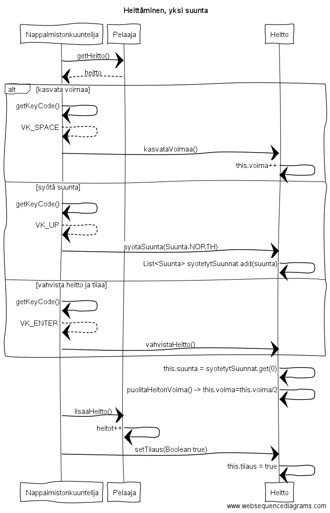
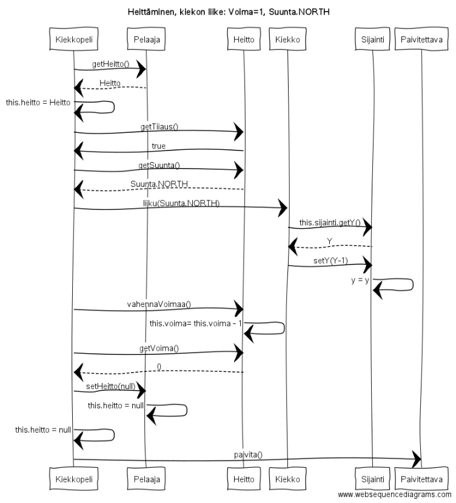
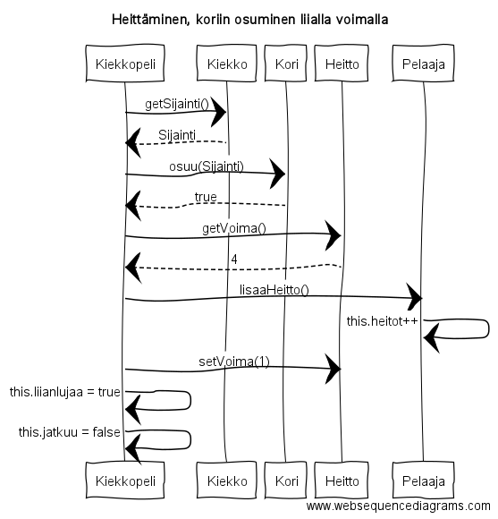

**Aihe:** Golffauspeli. 

**Rakenne:** Frisbee lentää koriin.
Kiekolla on ominaisuuksia. Pelaajalla on kiekkoja. Kiekko heitetään koriin antamalla heiton voimakkuus ja suunta. Korin sijainti riippuu radasta. Radalle tulee mahdollisesti esteitä. Mukaan tulee mahdollisesti myös olosuhteet(tuuli).

Aluksi kiekko heitetään koriin, mahdollisimman vähillä heitoilla. Jotta kiekko menisi koriin on sen osuttava riittävän lähelle korin keskustaa, ilman liian suurta jäljelle jäävää voimaa.

Aluksi yksinpeli, myöhemmin ehkä moninpeli.

Pelataan näppäimistöllä. Hiirtä käytetään valikoissa siirtymiseen.

**Käyttäjä:** Pelaaja, (pelaajat)

**Kaikkien käyttäjien toiminnot:** Pelaajatunnuksen luominen, frisbeen heittäminen

**Kaaviot:** 

**Rakennekuvaus:**
Kiekkopeli on pääpeliluokka. Se luodaan mainissa ensin ja sitten annetaan pääkäyttöliittymäluokalle Kayttoliittyma parametrina tätä luodessa.

Yhteydet muihin ui luokkiin kulkevat Kayttoliittyman ja sitä kautta Kiekkopeli luokan kautta, josta saadaan haettua tarvittavat muut luokat, eri asioiden ruudulle päivittämistä varten.

Tapahtumankuuntelijat kuuntelevat mitä käyttäjä tekee pyytävät logiikkaluokkia toimimaan tämän mukaisesti. Nappaimistonkuuntelija on itse pelaamisesta(heittämisestä) vastuullinen tapahtumankuuntelija. Kiekonvaihtonapinkuuntelija kuuntelee milloin käyttäjä haluaa vaihtaa kiekkoa, ja ilmoittaa tästä logiikalle. Vaylanvaihtonapinkuuntelija tekee saman väylien vaihdon suhteen. Muut kuuntelijat liittyvät valikossa liikkumiseen.

Pelin valikossa on neljä ikkunaa, ja näihin liittyy nappeja tai JPaneleita, jotka näyttävät halutut asiat käyttäjälle.

Logiikkaan kuuluu useita luokkia, jotka avustavat pääpeliluokkaa eli Kiekkopeliä. Näitä ovat Pelaaja, jolla on Kiekkoja ja Heitto.
